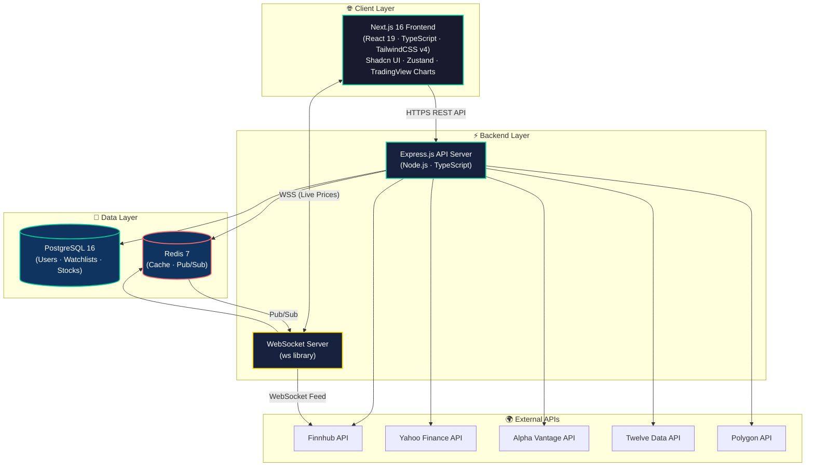
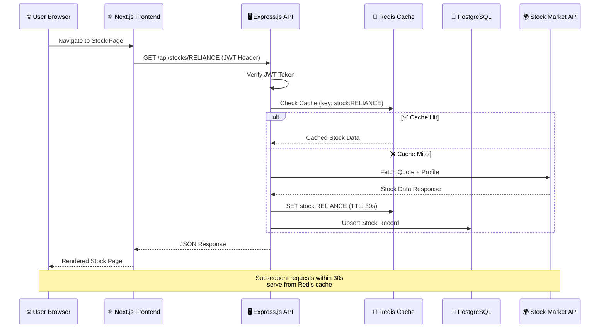
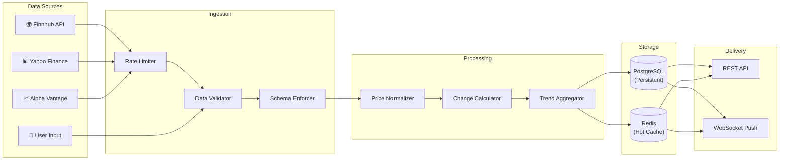
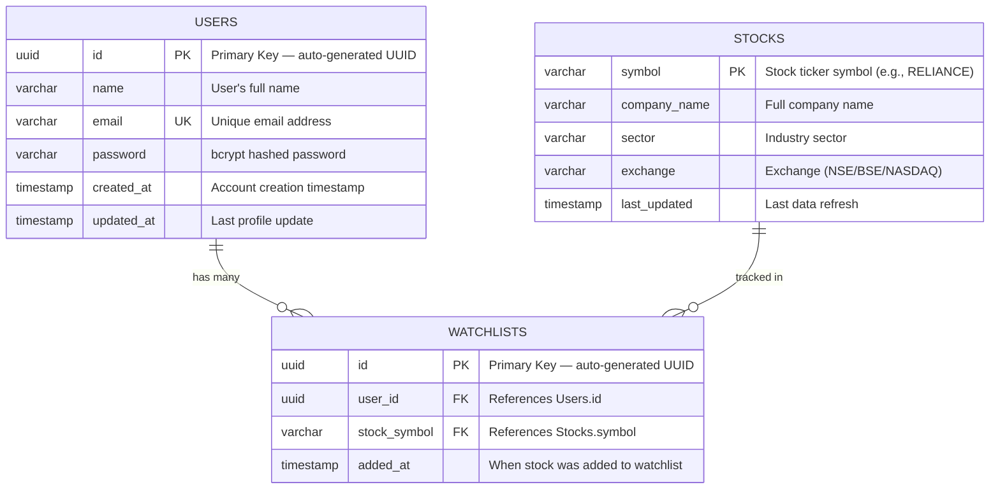
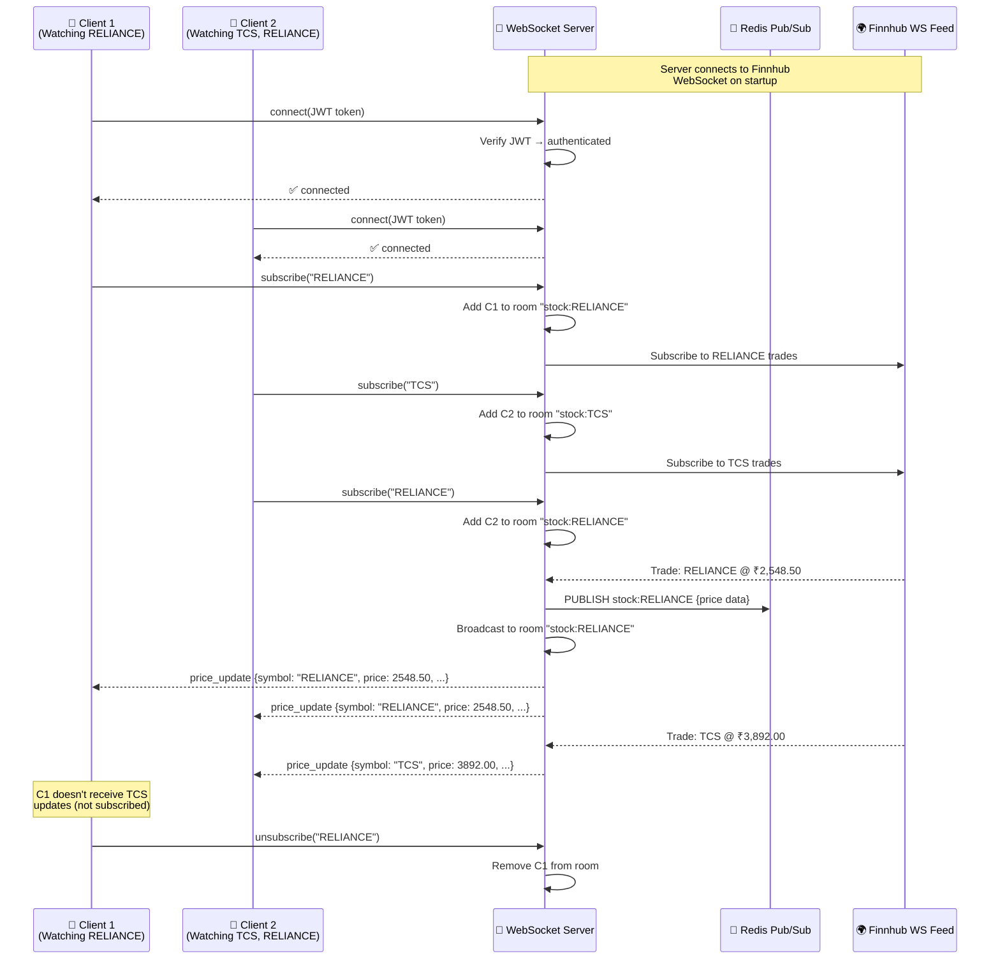
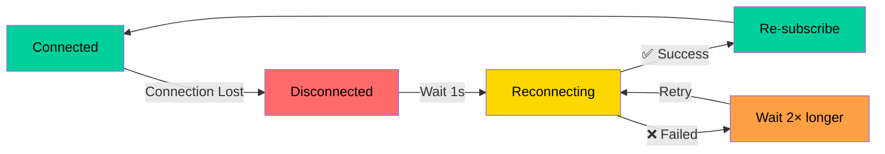
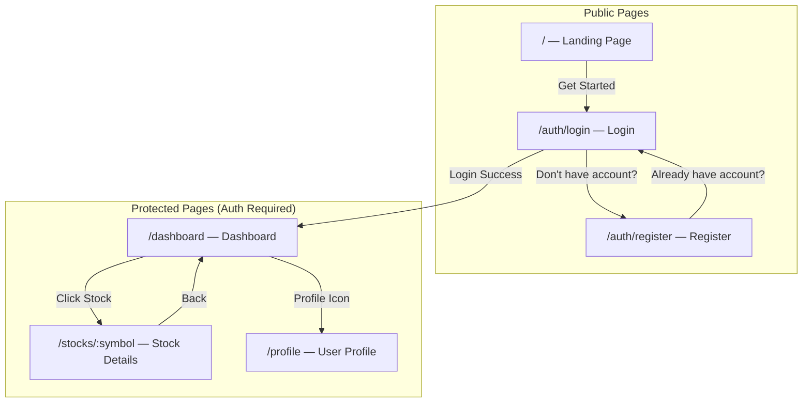
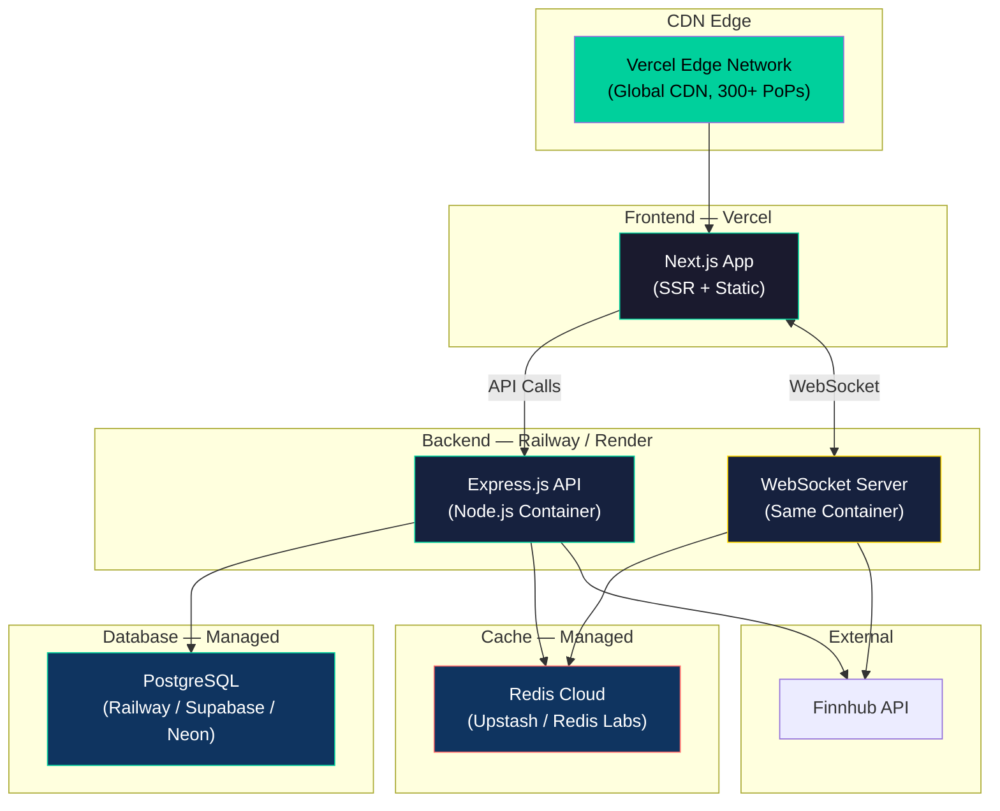
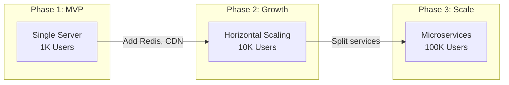

# 📈 StockVista — Live Stock Tracking App

> **A Groww-Inspired Full-Stack Stock Market Tracking Platform**

> **Document Type**: System Architecture + Technical Design + API Documentation  
> **Version**: 1.0  
> **Date**: June 7, 2026  
> **Status**: ✅ APPROVED  

---

## Table of Contents

1. [Product Overview](#1-product-overview)
2. [System Architecture](#2-system-architecture)
3. [Database Design](#3-database-design)
4. [API Documentation](#4-api-documentation)
5. [Real-Time System](#5-real-time-system)
6. [Frontend Design](#6-frontend-design)
7. [Charting Integration](#7-charting-integration)
8. [Folder Structure](#8-folder-structure)
9. [Security](#9-security)
10. [Deployment Plan](#10-deployment-plan)
11. [Scaling Strategy](#11-scaling-strategy)
12. [Development Roadmap](#12-development-roadmap)
13. [Future Enhancements](#13-future-enhancements)

---

## 1. Product Overview

### 1.1 What Is StockVista?

StockVista is a **live stock market tracking web application** inspired by Groww. It allows users to view real-time stock prices, analyze stocks with candlestick charts, build personal watchlists, and track market trends — all within a beautiful, responsive interface.

> [!IMPORTANT]
> This is **NOT** a trading platform. It is designed purely for **learning and stock tracking** purposes. No buy/sell/order execution is involved.

### 1.2 Core Features

| Feature | Description |
|---------|-------------|
| **Live Stock Prices** | Real-time price updates via WebSocket |
| **Stock Search** | Search by stock symbol or company name (e.g., TCS, INFY, RELIANCE, HDFCBANK) |
| **Stock Details** | View Current Price, Day High/Low, Open, Previous Close, Market Cap, P/E Ratio, Volume |
| **Candlestick Charts** | Interactive candlestick + volume charts powered by TradingView Lightweight Charts |
| **Watchlist** | Add/remove stocks, track price changes in a personal watchlist |
| **Gain/Loss Tracking** | Visual indicators for stock performance (green/red) |
| **Top Gainers & Losers** | Daily market movers at a glance |
| **Market Indices** | NIFTY 50 and SENSEX live tracking |
| **Trending Stocks** | Most-watched stocks across the platform |
| **User Authentication** | Secure JWT-based register/login/logout |

### 1.3 Target Users

| Persona | Need |
|---------|------|
| **Retail Investor** | Track portfolio stocks, follow market trends |
| **Stock Market Learner** | Understand market movements, learn chart reading |
| **Finance Enthusiast** | Daily market overview, watchlist curation |

---

## 2. System Architecture

### 2.1 Technology Stack

| Layer | Technology | Purpose |
|-------|-----------|---------|
| **Frontend** | Next.js, TypeScript, TailwindCSS, Shadcn UI, Zustand | UI, state management, styling |
| **Backend** | Node.js, Express.js, TypeScript | REST API, business logic |
| **Database** | PostgreSQL | Persistent data storage |
| **Cache** | Redis | API response caching, pub/sub |
| **Real-Time** | WebSockets (ws) | Live price updates |
| **Stock Data** | Finnhub / Yahoo Finance / Alpha Vantage / Twelve Data / Polygon | Market data APIs |
| **Charting** | TradingView Lightweight Charts | Candlestick & line charts |
| **Auth** | JWT (jsonwebtoken) + bcrypt | Authentication & security |
| **ORM** | Prisma | Type-safe database access |
| **Validation** | Zod | Request/response validation |

### 2.2 High-Level Architecture Diagram



### 2.3 Request Flow Architecture



### 2.4 Data Flow Overview



---

## 3. Database Design

### 3.1 Entity-Relationship Diagram



### 3.2 Table Definitions

#### Users Table

| Column | Type | Constraints | Description |
|--------|------|-------------|-------------|
| `id` | `UUID` | `PRIMARY KEY`, `DEFAULT gen_random_uuid()` | Unique user identifier |
| `name` | `VARCHAR(100)` | `NOT NULL` | User's display name |
| `email` | `VARCHAR(255)` | `NOT NULL`, `UNIQUE` | Login email address |
| `password` | `VARCHAR(255)` | `NOT NULL` | bcrypt-hashed password (60 chars) |
| `created_at` | `TIMESTAMP` | `DEFAULT NOW()` | Account creation time |
| `updated_at` | `TIMESTAMP` | `DEFAULT NOW()` | Last modification time |

#### Watchlists Table

| Column | Type | Constraints | Description |
|--------|------|-------------|-------------|
| `id` | `UUID` | `PRIMARY KEY`, `DEFAULT gen_random_uuid()` | Unique watchlist entry ID |
| `user_id` | `UUID` | `FOREIGN KEY → Users.id`, `ON DELETE CASCADE` | Owning user |
| `stock_symbol` | `VARCHAR(20)` | `NOT NULL` | Stock ticker (e.g., `RELIANCE`) |
| `added_at` | `TIMESTAMP` | `DEFAULT NOW()` | When added |

> **Unique Constraint**: `(user_id, stock_symbol)` — prevents duplicate entries.

#### Stocks Table

| Column | Type | Constraints | Description |
|--------|------|-------------|-------------|
| `symbol` | `VARCHAR(20)` | `PRIMARY KEY` | Stock ticker symbol |
| `company_name` | `VARCHAR(255)` | `NOT NULL` | Full company name |
| `sector` | `VARCHAR(100)` | | Industry sector |
| `exchange` | `VARCHAR(10)` | | Exchange code (NSE, BSE, etc.) |
| `last_updated` | `TIMESTAMP` | `DEFAULT NOW()` | Last data refresh |

### 3.3 Prisma Schema

```prisma
generator client {
  provider = "prisma-client-js"
}

datasource db {
  provider = "postgresql"
  url      = env("DATABASE_URL")
}

model User {
  id        String     @id @default(uuid()) @db.Uuid
  name      String     @db.VarChar(100)
  email     String     @unique @db.VarChar(255)
  password  String     @db.VarChar(255)
  createdAt DateTime   @default(now()) @map("created_at")
  updatedAt DateTime   @updatedAt @map("updated_at")
  watchlist Watchlist[]

  @@map("users")
}

model Watchlist {
  id          String   @id @default(uuid()) @db.Uuid
  userId      String   @map("user_id") @db.Uuid
  stockSymbol String   @map("stock_symbol") @db.VarChar(20)
  addedAt     DateTime @default(now()) @map("added_at")
  user        User     @relation(fields: [userId], references: [id], onDelete: Cascade)
  stock       Stock    @relation(fields: [stockSymbol], references: [symbol])

  @@unique([userId, stockSymbol])
  @@map("watchlists")
}

model Stock {
  symbol      String     @id @db.VarChar(20)
  companyName String     @map("company_name") @db.VarChar(255)
  sector      String?    @db.VarChar(100)
  exchange    String?    @db.VarChar(10)
  lastUpdated DateTime   @default(now()) @map("last_updated")
  watchlists  Watchlist[]

  @@map("stocks")
}
```

### 3.4 Index Strategy

```sql
-- Watchlist: Fast lookup by user
CREATE INDEX idx_watchlist_user_id ON watchlists (user_id);

-- Watchlist: Fast lookup by stock symbol
CREATE INDEX idx_watchlist_stock_symbol ON watchlists (stock_symbol);

-- Stocks: Search by company name (partial match)
CREATE INDEX idx_stocks_company_name ON stocks USING gin (company_name gin_trgm_ops);

-- Users: Email lookup for login
-- (Covered by UNIQUE constraint on email)
```

---

## 4. API Documentation

### 4.1 Base URL

```
Development: http://localhost:5000/api
Production:  https://api.stockvista.com/api
```

### 4.2 Authentication Headers

All protected routes require:

```
Authorization: Bearer <JWT_TOKEN>
```

---

### 4.3 Authentication Endpoints

#### POST `/api/auth/register`

Register a new user account.

**Request Body:**
```json
{
  "name": "Priyanshu",
  "email": "priyanshu@example.com",
  "password": "SecurePass123!"
}
```

**Success Response (201):**
```json
{
  "success": true,
  "data": {
    "user": {
      "id": "550e8400-e29b-41d4-a716-446655440000",
      "name": "Priyanshu",
      "email": "priyanshu@example.com",
      "createdAt": "2026-06-07T16:00:00.000Z"
    },
    "token": "eyJhbGciOiJIUzI1NiIsInR5cCI6IkpXVCJ9..."
  }
}
```

**Error Response (409):**
```json
{
  "success": false,
  "error": "User with this email already exists"
}
```

---

#### POST `/api/auth/login`

Authenticate and receive a JWT token.

**Request Body:**
```json
{
  "email": "priyanshu@example.com",
  "password": "SecurePass123!"
}
```

**Success Response (200):**
```json
{
  "success": true,
  "data": {
    "user": {
      "id": "550e8400-e29b-41d4-a716-446655440000",
      "name": "Priyanshu",
      "email": "priyanshu@example.com"
    },
    "token": "eyJhbGciOiJIUzI1NiIsInR5cCI6IkpXVCJ9..."
  }
}
```

**Error Response (401):**
```json
{
  "success": false,
  "error": "Invalid email or password"
}
```

---

#### GET `/api/auth/profile` 🔒

Get the authenticated user's profile.

**Headers:** `Authorization: Bearer <token>`

**Success Response (200):**
```json
{
  "success": true,
  "data": {
    "id": "550e8400-e29b-41d4-a716-446655440000",
    "name": "Priyanshu",
    "email": "priyanshu@example.com",
    "createdAt": "2026-06-07T16:00:00.000Z",
    "watchlistCount": 12
  }
}
```

---

### 4.4 Stock Endpoints

#### GET `/api/stocks/search?q={query}`

Search stocks by symbol or company name.

**Query Parameters:**

| Param | Type | Required | Description |
|-------|------|----------|-------------|
| `q` | string | ✅ | Search query (min 1 character) |
| `limit` | number | ❌ | Max results (default: 10, max: 50) |

**Example:** `GET /api/stocks/search?q=RELI&limit=5`

**Success Response (200):**
```json
{
  "success": true,
  "data": [
    {
      "symbol": "RELIANCE",
      "companyName": "Reliance Industries Limited",
      "sector": "Energy",
      "exchange": "NSE"
    },
    {
      "symbol": "RELIANCEINFRA",
      "companyName": "Reliance Infrastructure Limited",
      "sector": "Infrastructure",
      "exchange": "NSE"
    }
  ],
  "count": 2
}
```

---

#### GET `/api/stocks/:symbol`

Get detailed stock information with live price.

**Example:** `GET /api/stocks/RELIANCE`

**Success Response (200):**
```json
{
  "success": true,
  "data": {
    "symbol": "RELIANCE",
    "companyName": "Reliance Industries Limited",
    "sector": "Energy",
    "exchange": "NSE",
    "quote": {
      "currentPrice": 2547.80,
      "change": 32.45,
      "changePercent": 1.29,
      "dayHigh": 2565.00,
      "dayLow": 2510.30,
      "open": 2520.00,
      "previousClose": 2515.35,
      "volume": 12500000,
      "marketCap": 1724000000000,
      "peRatio": 28.5,
      "fiftyTwoWeekHigh": 2856.15,
      "fiftyTwoWeekLow": 2180.00
    },
    "profile": {
      "industry": "Oil & Gas Refining & Marketing",
      "website": "https://www.ril.com",
      "description": "Reliance Industries Limited operates as a conglomerate...",
      "logo": "https://static.finnhub.io/logo/reliance.png",
      "employeeCount": 236334,
      "ipoDate": "1977-01-01"
    }
  }
}
```

---

#### GET `/api/stocks/top-gainers`

Get today's top gaining stocks.

**Query Parameters:**

| Param | Type | Required | Description |
|-------|------|----------|-------------|
| `limit` | number | ❌ | Max results (default: 10) |

**Success Response (200):**
```json
{
  "success": true,
  "data": [
    {
      "symbol": "ADANIENT",
      "companyName": "Adani Enterprises",
      "currentPrice": 3200.50,
      "change": 145.30,
      "changePercent": 4.75
    },
    {
      "symbol": "TATAMOTORS",
      "companyName": "Tata Motors Limited",
      "currentPrice": 985.25,
      "change": 38.50,
      "changePercent": 4.07
    }
  ]
}
```

---

#### GET `/api/stocks/top-losers`

Get today's top losing stocks. Same response format as top-gainers with negative change values.

---

#### GET `/api/stocks/trending`

Get trending stocks (most-added to watchlists across the platform).

**Success Response (200):**
```json
{
  "success": true,
  "data": [
    {
      "symbol": "TCS",
      "companyName": "Tata Consultancy Services",
      "currentPrice": 3890.00,
      "change": 12.50,
      "changePercent": 0.32,
      "watchlistCount": 1245
    },
    {
      "symbol": "INFY",
      "companyName": "Infosys Limited",
      "currentPrice": 1580.75,
      "change": -8.20,
      "changePercent": -0.52,
      "watchlistCount": 1102
    }
  ]
}
```

---

### 4.5 Watchlist Endpoints

#### GET `/api/watchlist` 🔒

Get the authenticated user's watchlist with live prices.

**Success Response (200):**
```json
{
  "success": true,
  "data": [
    {
      "id": "a1b2c3d4-e5f6-7890-abcd-ef1234567890",
      "stockSymbol": "RELIANCE",
      "companyName": "Reliance Industries Limited",
      "addedAt": "2026-06-05T10:00:00.000Z",
      "quote": {
        "currentPrice": 2547.80,
        "change": 32.45,
        "changePercent": 1.29
      }
    },
    {
      "id": "b2c3d4e5-f6a7-8901-bcde-f12345678901",
      "stockSymbol": "TCS",
      "companyName": "Tata Consultancy Services",
      "addedAt": "2026-06-06T14:30:00.000Z",
      "quote": {
        "currentPrice": 3890.00,
        "change": 12.50,
        "changePercent": 0.32
      }
    }
  ],
  "count": 2
}
```

---

#### POST `/api/watchlist` 🔒

Add a stock to the user's watchlist.

**Request Body:**
```json
{
  "stockSymbol": "HDFCBANK"
}
```

**Success Response (201):**
```json
{
  "success": true,
  "data": {
    "id": "c3d4e5f6-a7b8-9012-cdef-123456789012",
    "stockSymbol": "HDFCBANK",
    "addedAt": "2026-06-07T16:10:00.000Z"
  },
  "message": "HDFCBANK added to watchlist"
}
```

**Error Response (409):**
```json
{
  "success": false,
  "error": "HDFCBANK is already in your watchlist"
}
```

---

#### DELETE `/api/watchlist/:id` 🔒

Remove a stock from the user's watchlist.

**Example:** `DELETE /api/watchlist/c3d4e5f6-a7b8-9012-cdef-123456789012`

**Success Response (200):**
```json
{
  "success": true,
  "message": "Stock removed from watchlist"
}
```

---

### 4.6 API Error Format

All errors follow a consistent format:

```json
{
  "success": false,
  "error": "Human-readable error message",
  "code": "ERROR_CODE",
  "details": {}
}
```

| HTTP Code | Error Code | Description |
|-----------|-----------|-------------|
| `400` | `VALIDATION_ERROR` | Invalid request body/params |
| `401` | `UNAUTHORIZED` | Missing or invalid JWT token |
| `403` | `FORBIDDEN` | Valid token but insufficient permissions |
| `404` | `NOT_FOUND` | Resource not found |
| `409` | `CONFLICT` | Duplicate resource (e.g., email, watchlist entry) |
| `429` | `RATE_LIMITED` | Too many requests |
| `500` | `INTERNAL_ERROR` | Server error |

---

## 5. Real-Time System

### 5.1 WebSocket Architecture



### 5.2 Socket Rooms

Socket rooms allow efficient message routing — only clients watching a specific stock receive updates for that stock.

| Room Name | Pattern | Description |
|-----------|---------|-------------|
| `stock:{SYMBOL}` | `stock:RELIANCE` | All clients watching RELIANCE |
| `market:indices` | `market:indices` | Clients watching NIFTY 50 / SENSEX |
| `market:status` | `market:status` | Market open/close notifications |

**Room Lifecycle:**

```
Client subscribes to "RELIANCE"
  → Server adds client to room "stock:RELIANCE"
  → If room was empty, subscribe to Finnhub feed for RELIANCE

Client unsubscribes from "RELIANCE"
  → Server removes client from room
  → If room is now empty, unsubscribe from Finnhub feed (save API quota)

Client disconnects
  → Server removes client from ALL rooms
  → Clean up empty rooms
```

### 5.3 Event Types

#### Client → Server Events

| Event | Payload | Description |
|-------|---------|-------------|
| `subscribe` | `{ symbol: "RELIANCE" }` | Join a stock's price room |
| `unsubscribe` | `{ symbol: "RELIANCE" }` | Leave a stock's price room |
| `ping` | `{}` | Keepalive heartbeat |

#### Server → Client Events

| Event | Payload | Description |
|-------|---------|-------------|
| `connected` | `{ clientId: "abc123" }` | Connection confirmed |
| `price_update` | `{ symbol, price, change, changePercent, volume, timestamp }` | Live price tick |
| `market_status` | `{ status: "open" \| "closed", nextEvent: "..." }` | Market open/close |
| `error` | `{ code, message }` | Error notification |
| `pong` | `{}` | Heartbeat response |

#### Price Update Payload

```json
{
  "event": "price_update",
  "data": {
    "symbol": "RELIANCE",
    "price": 2548.50,
    "change": 33.15,
    "changePercent": 1.32,
    "volume": 12650000,
    "timestamp": "2026-06-07T10:30:15.000Z",
    "dayHigh": 2565.00,
    "dayLow": 2510.30
  }
}
```

### 5.4 Reconnection Logic

The client implements **exponential backoff** for automatic reconnection:

```
Attempt 1: Wait 1 second
Attempt 2: Wait 2 seconds
Attempt 3: Wait 4 seconds
Attempt 4: Wait 8 seconds
Attempt 5: Wait 16 seconds
Attempt 6+: Wait 30 seconds (max)
```

**Implementation Details:**

| Behavior | Detail |
|----------|--------|
| **Server Heartbeat** | Server sends `ping` every 30 seconds |
| **Client Timeout** | If no `ping` received for 45 seconds, assume disconnected |
| **Reconnection** | Auto-reconnect with exponential backoff (max 30s) |
| **Resubscription** | On reconnect, client re-subscribes to all previous symbols |
| **Max Retries** | Unlimited (with max delay cap at 30s) |
| **Jitter** | Add random ±20% jitter to prevent thundering herd |



---

## 6. Frontend Design

### 6.1 Pages Overview



### 6.2 Landing Page

**Features:**
- **Hero Section** — Animated gradient background, headline ("Track Stocks Like a Pro"), market pulse animation, CTA button
- **Market Overview** — NIFTY 50 and SENSEX live cards with sparkline charts
- **Trending Stocks** — Horizontal scrolling ticker of trending stocks with prices and change %
- **Features Showcase** — Grid of feature cards (Live Prices, Watchlists, Charts, etc.)
- **Footer** — Disclaimer, links

### 6.3 Dashboard

**Layout:**
```
┌──────────────────────────────────────────────────┐
│ Navbar [Logo] [Search ▾] [Watchlist] [👤 Profile] │
├──────────────────────────────────────────────────┤
│                                                  │
│  ┌─────────────┐  ┌─────────────┐               │
│  │  NIFTY 50   │  │   SENSEX    │               │
│  │  22,450.30  │  │  73,850.75  │               │
│  │  ▲ +0.85%   │  │  ▲ +0.72%   │               │
│  └─────────────┘  └─────────────┘               │
│                                                  │
│  ┌────────────────────────────────────────────┐  │
│  │ 📋 My Watchlist                            │  │
│  │ ┌────────┬───────┬────────┬───────────┐   │  │
│  │ │ Symbol │ Price │ Change │  Action    │   │  │
│  │ ├────────┼───────┼────────┼───────────┤   │  │
│  │ │ RELI.  │ 2548  │ +1.32% │  🗑 Remove │   │  │
│  │ │ TCS    │ 3890  │ +0.32% │  🗑 Remove │   │  │
│  │ │ INFY   │ 1580  │ -0.52% │  🗑 Remove │   │  │
│  │ └────────┴───────┴────────┴───────────┘   │  │
│  └────────────────────────────────────────────┘  │
│                                                  │
│  ┌──────────────────┐ ┌──────────────────┐      │
│  │ 📈 Top Gainers   │ │ 📉 Top Losers    │      │
│  │ ADANIENT  +4.75% │ │ WIPRO     -2.31% │      │
│  │ TATAMOT.  +4.07% │ │ SUNPH.    -1.85% │      │
│  │ BAJFIN.   +3.52% │ │ NESTLEIN. -1.42% │      │
│  │ LTIM      +2.89% │ │ HINDUNLVR -1.18% │      │
│  └──────────────────┘ └──────────────────┘      │
│                                                  │
│  ┌────────────────────────────────────────────┐  │
│  │ 🔥 Trending Stocks                        │  │
│  │ TCS | INFY | RELIANCE | HDFCBANK | ITC    │  │
│  └────────────────────────────────────────────┘  │
│                                                  │
├──────────────────────────────────────────────────┤
│ Footer [Disclaimer] [About] [GitHub]             │
└──────────────────────────────────────────────────┘
```

### 6.4 Stock Details Page

**Layout:**
```
┌──────────────────────────────────────────────────┐
│ ← Back to Dashboard         [+ Add to Watchlist] │
├──────────────────────────────────────────────────┤
│                                                  │
│  RELIANCE — Reliance Industries Limited          │
│  ₹2,547.80  ▲ +32.45 (+1.29%)                   │
│  NSE · Energy                                    │
│                                                  │
│  ┌────────────────────────────────────────────┐  │
│  │                                            │  │
│  │        📊 Candlestick Chart                │  │
│  │     (TradingView Lightweight Charts)       │  │
│  │                                            │  │
│  │  [1D] [1W] [1M] [3M] [1Y] [5Y]           │  │
│  └────────────────────────────────────────────┘  │
│                                                  │
│  ┌──────────┐ ┌──────────┐ ┌──────────┐        │
│  │ Day High │ │ Day Low  │ │  Open    │        │
│  │ ₹2,565   │ │ ₹2,510   │ │ ₹2,520   │        │
│  └──────────┘ └──────────┘ └──────────┘        │
│  ┌──────────┐ ┌──────────┐ ┌──────────┐        │
│  │Prev Close│ │Mkt Cap   │ │ P/E Ratio│        │
│  │ ₹2,515   │ │ ₹17.24L Cr│ │  28.5   │        │
│  └──────────┘ └──────────┘ └──────────┘        │
│  ┌──────────┐                                   │
│  │  Volume  │                                   │
│  │ 1.25 Cr  │                                   │
│  └──────────┘                                   │
│                                                  │
│  ┌────────────────────────────────────────────┐  │
│  │ 🏢 About Reliance Industries Limited      │  │
│  │                                            │  │
│  │ Industry: Oil & Gas Refining & Marketing   │  │
│  │ Website:  https://www.ril.com              │  │
│  │ IPO Date: January 1977                     │  │
│  │ Employees: 236,334                         │  │
│  │                                            │  │
│  │ Reliance Industries Limited operates as    │  │
│  │ a conglomerate company...                  │  │
│  └────────────────────────────────────────────┘  │
│                                                  │
└──────────────────────────────────────────────────┘
```

### 6.5 Profile Page

**Shows:**
- User name, email, member since date
- Total stocks in watchlist
- Watchlist overview (table of all tracked stocks)
- Logout button

---

## 7. Charting Integration

### 7.1 Library: TradingView Lightweight Charts

**Why TradingView Lightweight Charts?**

| Criteria | Lightweight Charts | Chart.js | Recharts |
|----------|-------------------|----------|----------|
| **Candlestick** | ✅ Native | ❌ Plugin | ❌ No |
| **Volume Bars** | ✅ Native | ⚠️ Manual | ⚠️ Manual |
| **Performance** | ✅ WebGL/Canvas | ⚠️ Canvas | ❌ SVG (slow) |
| **Financial Focus** | ✅ Built for stocks | ❌ General | ❌ General |
| **Bundle Size** | ✅ ~45KB gzipped | ⚠️ ~60KB | ❌ ~120KB |
| **Crosshair** | ✅ Built-in | ❌ Manual | ❌ Manual |
| **Time Scale** | ✅ Financial aware | ❌ Generic | ❌ Generic |

### 7.2 Chart Types Implemented

#### Candlestick Chart
- OHLC (Open, High, Low, Close) candles
- Green candle = price went up, Red candle = price went down
- Timeframe selectors: 1D, 1W, 1M, 3M, 1Y, 5Y
- Crosshair with price/time tooltip

#### Volume Bars
- Volume histogram below candlestick chart
- Color-coded: green for up-days, red for down-days
- Synced with candlestick time axis

#### Line Chart
- Simple price line for the landing page sparklines
- Mini inline charts in stock cards and watchlist

### 7.3 Integration Pattern

```typescript
// React component integration pattern
import { createChart, IChartApi, CandlestickSeries } from 'lightweight-charts';

function CandlestickChart({ symbol, timeframe }: Props) {
  const chartContainerRef = useRef<HTMLDivElement>(null);
  const chartRef = useRef<IChartApi | null>(null);

  useEffect(() => {
    if (!chartContainerRef.current) return;

    const chart = createChart(chartContainerRef.current, {
      layout: {
        background: { type: ColorType.Solid, color: '#0a0a0a' },
        textColor: '#d1d5db',
      },
      grid: {
        vertLines: { color: '#1f2937' },
        horzLines: { color: '#1f2937' },
      },
      crosshair: { mode: CrosshairMode.Normal },
      rightPriceScale: { borderColor: '#374151' },
      timeScale: { borderColor: '#374151', timeVisible: true },
    });

    const candleSeries = chart.addSeries(CandlestickSeries, {
      upColor: '#00d09c',
      downColor: '#ff6b6b',
      borderDownColor: '#ff6b6b',
      borderUpColor: '#00d09c',
      wickDownColor: '#ff6b6b',
      wickUpColor: '#00d09c',
    });

    // Fetch and set data
    fetchCandleData(symbol, timeframe).then(data => {
      candleSeries.setData(data);
    });

    chartRef.current = chart;
    return () => chart.remove();
  }, [symbol, timeframe]);

  return <div ref={chartContainerRef} style={{ width: '100%', height: 400 }} />;
}
```

### 7.4 Data Format

```typescript
// Candlestick data point
interface CandleData {
  time: string;    // "2026-06-07" or Unix timestamp
  open: number;    // Opening price
  high: number;    // Highest price
  low: number;     // Lowest price
  close: number;   // Closing price
}

// Volume data point
interface VolumeData {
  time: string;
  value: number;   // Volume
  color: string;   // "#00d09c" (green) or "#ff6b6b" (red)
}
```

---

## 8. Folder Structure

```
Financial-Marketing-Forecasting/
│
├── 📂 client/                          # Next.js Frontend Application
│   ├── 📂 app/                         # Next.js App Router pages
│   │   ├── 📄 layout.tsx               # Root layout (fonts, providers, metadata)
│   │   ├── 📄 page.tsx                 # Landing page (hero, market overview)
│   │   ├── 📄 globals.css              # Global styles, design tokens, animations
│   │   ├── 📂 auth/
│   │   │   ├── 📂 login/
│   │   │   │   └── 📄 page.tsx         # Login page
│   │   │   └── 📂 register/
│   │   │       └── 📄 page.tsx         # Registration page
│   │   ├── 📂 dashboard/
│   │   │   └── 📄 page.tsx             # Main dashboard (watchlist, gainers, losers)
│   │   ├── 📂 stocks/
│   │   │   └── 📂 [symbol]/
│   │   │       └── 📄 page.tsx         # Stock detail page (chart, info, price)
│   │   └── 📂 profile/
│   │       └── 📄 page.tsx             # User profile page
│   │
│   ├── 📂 components/                  # Reusable React components
│   │   ├── 📂 ui/                      # Shadcn UI base components
│   │   │   ├── 📄 button.tsx           # Button variants (primary, outline, ghost)
│   │   │   ├── 📄 card.tsx             # Card container component
│   │   │   ├── 📄 input.tsx            # Text input with variants
│   │   │   ├── 📄 badge.tsx            # Status/label badges
│   │   │   ├── 📄 dialog.tsx           # Modal dialog
│   │   │   ├── 📄 dropdown-menu.tsx    # Dropdown menu
│   │   │   ├── 📄 tabs.tsx             # Tab navigation
│   │   │   ├── 📄 skeleton.tsx         # Loading skeleton placeholder
│   │   │   ├── 📄 avatar.tsx           # User avatar
│   │   │   └── 📄 sheet.tsx            # Slide-over panel
│   │   │
│   │   ├── 📂 layout/                  # Layout components
│   │   │   ├── 📄 Navbar.tsx           # Top navigation bar (search, user menu)
│   │   │   └── 📄 Footer.tsx           # Page footer (disclaimer, links)
│   │   │
│   │   ├── 📂 stocks/                  # Stock-related components
│   │   │   ├── 📄 StockCard.tsx        # Stock card (symbol, price, change, sparkline)
│   │   │   ├── 📄 StockTable.tsx       # Table view (gainers/losers with sorting)
│   │   │   ├── 📄 PriceDisplay.tsx     # Live price with animated transitions
│   │   │   └── 📄 SearchBar.tsx        # Search with debounce + autocomplete
│   │   │
│   │   ├── 📂 charts/                  # Charting components
│   │   │   ├── 📄 CandlestickChart.tsx # TradingView candlestick + volume chart
│   │   │   └── 📄 SparklineChart.tsx   # Mini inline chart for cards
│   │   │
│   │   └── 📂 dashboard/              # Dashboard-specific components
│   │       ├── 📄 MarketIndices.tsx    # NIFTY 50 & SENSEX live cards
│   │       ├── 📄 WatchlistPanel.tsx   # User's watchlist with live prices
│   │       └── 📄 GainersLosers.tsx    # Tabbed top gainers/losers view
│   │
│   ├── 📂 store/                       # Zustand state management
│   │   ├── 📄 auth-store.ts           # Auth state (user, token, login/logout)
│   │   ├── 📄 stock-store.ts          # Stock data (prices, search, gainers/losers)
│   │   └── 📄 watchlist-store.ts      # Watchlist state (items, add/remove)
│   │
│   ├── 📂 services/                    # API client layer
│   │   ├── 📄 api.ts                  # Axios instance (base URL, JWT interceptor)
│   │   ├── 📄 stock-api.ts            # Stock API calls (search, detail, gainers)
│   │   ├── 📄 auth-api.ts             # Auth API calls (login, register, profile)
│   │   └── 📄 watchlist-api.ts        # Watchlist API calls (CRUD)
│   │
│   ├── 📂 hooks/                       # Custom React hooks
│   │   ├── 📄 useWebSocket.ts         # WebSocket connection + reconnection logic
│   │   ├── 📄 useStockPrice.ts        # REST + WebSocket combined price hook
│   │   └── 📄 useDebounce.ts          # Debounced value hook (for search)
│   │
│   ├── 📂 public/                      # Static assets
│   ├── 📄 package.json                 # Frontend dependencies
│   ├── 📄 tsconfig.json                # TypeScript config
│   ├── 📄 next.config.ts               # Next.js configuration
│   ├── 📄 postcss.config.mjs           # PostCSS (TailwindCSS)
│   └── 📄 eslint.config.mjs            # ESLint config
│
├── 📂 server/                          # Express.js Backend API
│   ├── 📂 src/
│   │   ├── 📄 index.ts                # Server entry point (Express + WS setup)
│   │   │
│   │   ├── 📂 controllers/            # Request handlers (thin layer)
│   │   │   ├── 📄 auth.controller.ts  # Register, Login, Profile handlers
│   │   │   ├── 📄 stocks.controller.ts# Search, Detail, Gainers, Losers handlers
│   │   │   └── 📄 watchlist.controller.ts # CRUD watchlist handlers
│   │   │
│   │   ├── 📂 routes/                 # Express route definitions
│   │   │   ├── 📄 auth.routes.ts      # /api/auth/* routes
│   │   │   ├── 📄 stocks.routes.ts    # /api/stocks/* routes
│   │   │   └── 📄 watchlist.routes.ts # /api/watchlist/* routes
│   │   │
│   │   ├── 📂 services/              # Business logic layer
│   │   │   ├── 📄 finnhub.service.ts  # Finnhub API wrapper (quotes, search, candles)
│   │   │   ├── 📄 cache.service.ts    # Redis cache wrapper (get/set/del with TTL)
│   │   │   └── 📄 stock.service.ts    # Stock business logic (DB + API + Cache)
│   │   │
│   │   ├── 📂 middlewares/            # Express middlewares
│   │   │   ├── 📄 auth.middleware.ts  # JWT verification + user extraction
│   │   │   └── 📄 validate.middleware.ts # Zod schema validation factory
│   │   │
│   │   ├── 📂 websocket/             # WebSocket server
│   │   │   ├── 📄 ws-server.ts       # WS setup, rooms, event routing
│   │   │   └── 📄 price-feed.ts      # Finnhub WS feed → room broadcasts
│   │   │
│   │   ├── 📂 database/              # Database utilities
│   │   │   ├── 📄 prisma.ts          # Prisma client singleton
│   │   │   └── 📄 seed.ts            # Seed script (initial stocks data)
│   │   │
│   │   └── 📂 utils/                 # Shared utilities
│   │       ├── 📄 jwt.ts             # JWT sign/verify helpers
│   │       └── 📄 errors.ts          # Custom error classes
│   │
│   ├── 📂 prisma/
│   │   └── 📄 schema.prisma          # Database schema definition
│   │
│   ├── 📄 package.json               # Backend dependencies
│   ├── 📄 tsconfig.json              # TypeScript config
│   ├── 📄 .env                       # Environment variables (git-ignored)
│   └── 📄 .env.example               # Env template
│
├── 📂 shared/                         # Shared TypeScript types
│   └── 📂 types/
│       ├── 📄 stock.ts               # StockQuote, StockProfile, CandleData
│       ├── 📄 user.ts                # User, AuthResponse
│       ├── 📄 watchlist.ts           # WatchlistItem, WatchlistResponse
│       └── 📄 websocket.ts           # WS event types, payloads
│
├── 📂 docs/                           # Documentation
│   └── 📂 architecture/
│       ├── 📄 system-architecture-document.md  # ML forecasting architecture
│       └── 📄 stock-tracking-app-architecture.md # This document
│
├── 📂 ml_core/                        # Machine Learning pipeline (existing)
│
├── 📄 docker-compose.yml             # PostgreSQL + Redis for development
├── 📄 README.md                       # Project README
└── 📄 .gitignore                      # Git ignore rules
```

### 8.1 Folder Explanations

| Folder | Purpose |
|--------|---------|
| **`client/app/`** | Next.js App Router — each subfolder is a page route. `layout.tsx` defines the root shell, `page.tsx` is the landing page. Dynamic routes like `[symbol]` enable `/stocks/RELIANCE`. |
| **`client/components/ui/`** | Shadcn UI primitives — pre-styled, accessible components (Button, Card, Input, Dialog, etc.) built on Radix UI. Used as building blocks for all custom components. |
| **`client/components/layout/`** | App-wide structural components — Navbar appears on every page, Footer for disclaimers. Shared across all routes. |
| **`client/components/stocks/`** | Stock-specific UI — cards for displaying stocks in lists, tables for gainers/losers, search with autocomplete. Composed into pages. |
| **`client/components/charts/`** | TradingView chart wrappers — handles chart lifecycle (create, update, destroy), responsiveness, and timeframe switching. |
| **`client/components/dashboard/`** | Dashboard-only widgets — market index cards, watchlist panel, gainers/losers tabs. Composed into the dashboard page. |
| **`client/store/`** | Zustand stores — lightweight client-side state. `auth-store` manages JWT + user, `stock-store` caches fetched data, `watchlist-store` tracks the user's watchlist. |
| **`client/services/`** | API client — centralized Axios instance with JWT interceptor. Each file maps to a backend API domain (auth, stocks, watchlist). |
| **`client/hooks/`** | Custom React hooks — `useWebSocket` manages WS lifecycle with auto-reconnect, `useStockPrice` combines REST + WS for real-time prices, `useDebounce` smooths search input. |
| **`server/src/controllers/`** | Request handlers — thin layer that parses request, calls service, returns response. No business logic here. |
| **`server/src/routes/`** | Route definitions — maps HTTP methods + paths to controllers. Groups related endpoints. |
| **`server/src/services/`** | Business logic — where the real work happens. `finnhub.service.ts` wraps the external API, `cache.service.ts` wraps Redis, `stock.service.ts` orchestrates DB + API + cache. |
| **`server/src/middlewares/`** | Express middlewares — auth middleware verifies JWT on every protected route. Validate middleware runs Zod schemas on request bodies. |
| **`server/src/websocket/`** | WebSocket server — manages rooms, client subscriptions, and the Finnhub price feed. Broadcasts real-time price updates to subscribed clients. |
| **`server/src/database/`** | Database utilities — Prisma client singleton (prevents connection pool exhaustion in dev), seed script for initial stock data. |
| **`server/prisma/`** | Prisma schema — defines the database tables, relations, and indexes. Source of truth for the database. |
| **`shared/types/`** | Shared TypeScript interfaces — ensures frontend and backend agree on data shapes. Import from both projects. |

---

## 9. Security

### 9.1 JWT Authentication

**How it works:**

```
1. User registers/logs in → Server creates JWT with user ID + email
2. JWT is returned to client → Stored in Zustand (memory) / localStorage
3. Every API request → Client sends JWT in Authorization header
4. Server middleware → Verifies JWT signature, extracts user, attaches to req
5. Token expires → Client redirects to login
```

**Implementation:**

| Setting | Value | Rationale |
|---------|-------|-----------|
| Algorithm | HS256 | Fast, sufficient for single-server |
| Secret | 256-bit random | Environment variable, never in code |
| Expiry | 7 days | Balance between security and UX |
| Payload | `{ userId, email, iat, exp }` | Minimal — lookup user from DB if more needed |

```typescript
// Token generation
jwt.sign({ userId: user.id, email: user.email }, JWT_SECRET, { expiresIn: '7d' });

// Token verification (middleware)
const decoded = jwt.verify(token, JWT_SECRET);
req.user = decoded; // Attach to request
```

### 9.2 Password Hashing

**Library:** `bcryptjs`

| Setting | Value | Rationale |
|---------|-------|-----------|
| Algorithm | bcrypt | Industry standard, resistant to rainbow tables |
| Salt Rounds | 12 | ~250ms to hash — good balance of security vs. speed |
| Storage | Only hash stored | Plain password never persisted |

```typescript
// Registration
const hash = await bcrypt.hash(password, 12);

// Login verification
const isValid = await bcrypt.compare(password, user.password);
```

### 9.3 Rate Limiting

**Library:** `express-rate-limit`

| Endpoint | Window | Max Requests | Purpose |
|----------|--------|-------------|---------|
| `/api/auth/*` | 15 min | 10 | Prevent brute-force login |
| `/api/stocks/*` | 1 min | 60 | Match Finnhub free tier limits |
| `/api/watchlist/*` | 1 min | 30 | Prevent abuse |
| Global | 1 min | 100 | Overall protection |

```typescript
const authLimiter = rateLimit({
  windowMs: 15 * 60 * 1000, // 15 minutes
  max: 10,
  message: { error: 'Too many attempts, try again after 15 minutes' }
});

app.use('/api/auth', authLimiter);
```

### 9.4 CORS (Cross-Origin Resource Sharing)

**Library:** `cors`

```typescript
app.use(cors({
  origin: process.env.CORS_ORIGIN || 'http://localhost:3000',
  credentials: true,
  methods: ['GET', 'POST', 'PUT', 'DELETE'],
  allowedHeaders: ['Content-Type', 'Authorization'],
}));
```

| Setting | Value | Rationale |
|---------|-------|-----------|
| Origin | Explicit frontend URL | No wildcards in production |
| Credentials | true | Allow JWT in headers |
| Methods | GET, POST, PUT, DELETE | Only needed HTTP methods |

### 9.5 Input Validation

**Library:** `zod`

Every API endpoint validates its input using Zod schemas before processing. Invalid input is rejected with a 400 error and descriptive messages.

```typescript
// Registration schema
const registerSchema = z.object({
  name: z.string().min(2).max(100),
  email: z.string().email(),
  password: z.string().min(8).max(128)
    .regex(/[A-Z]/, 'Must contain uppercase letter')
    .regex(/[a-z]/, 'Must contain lowercase letter')
    .regex(/[0-9]/, 'Must contain number'),
});

// Validation middleware
const validate = (schema: ZodSchema) => (req, res, next) => {
  const result = schema.safeParse(req.body);
  if (!result.success) {
    return res.status(400).json({
      success: false,
      error: 'Validation failed',
      details: result.error.issues
    });
  }
  req.body = result.data;
  next();
};
```

### 9.6 Additional Security Measures

| Measure | Library | Purpose |
|---------|---------|---------|
| **Helmet** | `helmet` | Sets security HTTP headers (X-Content-Type-Options, X-Frame-Options, CSP, etc.) |
| **HTTPS** | Deployment | All production traffic over TLS 1.3 |
| **SQL Injection** | Prisma ORM | Parameterized queries by default |
| **XSS** | React | Auto-escapes JSX output |
| **Environment Variables** | `.env` | Secrets never hardcoded |

---

## 10. Deployment Plan

### 10.1 Deployment Architecture



### 10.2 Deployment Details

| Component | Platform | Plan | Cost | Notes |
|-----------|----------|------|------|-------|
| **Frontend** | Vercel | Hobby (Free) | $0/mo | Auto-deploy from GitHub, global CDN, SSR |
| **Backend** | Railway | Starter | ~$5/mo | Docker container, auto-scaling, logs |
| **Backend (Alt)** | Render | Free | $0/mo | Spins down on inactivity (cold start ~30s) |
| **PostgreSQL** | Railway / Neon | Free Tier | $0/mo | Railway: 1GB free. Neon: 512MB free, serverless |
| **Redis** | Upstash | Free Tier | $0/mo | 10K commands/day free, serverless, global |
| **Stock API** | Finnhub | Free | $0/mo | 60 API calls/min |

> **Total cost for MVP: $0–$5/month**

### 10.3 Environment Configuration

**Vercel (Frontend):**
```env
NEXT_PUBLIC_API_URL=https://api.stockvista.com
NEXT_PUBLIC_WS_URL=wss://api.stockvista.com/ws
```

**Railway/Render (Backend):**
```env
PORT=5000
NODE_ENV=production
DATABASE_URL=postgresql://...@railway/stockvista
REDIS_URL=redis://...@upstash-redis
JWT_SECRET=<256-bit-random-secret>
FINNHUB_API_KEY=<your-api-key>
CORS_ORIGIN=https://stockvista.vercel.app
```

### 10.4 CI/CD Pipeline

```
GitHub Push → Vercel Auto-Deploy (Frontend)
GitHub Push → Railway Auto-Deploy (Backend)

Branch Strategy:
  main    → Production deployment
  develop → Preview deployment (Vercel preview URLs)
  feature/* → PR preview deployments
```

---

## 11. Scaling Strategy

### 11.1 Current → Future Scaling Path



### 11.2 Scaling Strategies by Component

| Component | Phase 1 (1K Users) | Phase 2 (10K Users) | Phase 3 (100K Users) |
|-----------|-------------------|--------------------|--------------------|
| **Frontend** | Vercel (auto-scales) | Same | Same (Vercel handles it) |
| **Backend** | Single instance | 2–3 instances + load balancer | Microservices (auth, stocks, ws) |
| **WebSocket** | Same process as API | Dedicated WS server | WS cluster with Redis adapter |
| **PostgreSQL** | Single instance | Connection pooling (PgBouncer) | Read replicas + connection pooling |
| **Redis** | Single instance | Redis Cluster | Redis Cluster (multi-region) |
| **Stock API** | Finnhub free (60/min) | Finnhub paid + caching | Multiple providers + local cache |

### 11.3 Key Scaling Techniques

#### Connection Pooling
```
Prisma → PgBouncer → PostgreSQL
(Limits: 20 Prisma connections → 5 PgBouncer connections → PostgreSQL)
```

#### Redis Caching Strategy
| Data | TTL | Cache Key Pattern | Hit Rate |
|------|-----|-------------------|----------|
| Stock Quote | 30s | `quote:{symbol}` | ~80% |
| Company Profile | 24h | `profile:{symbol}` | ~95% |
| Search Results | 5min | `search:{query}` | ~70% |
| Top Gainers/Losers | 1min | `top:gainers`, `top:losers` | ~90% |
| Trending Stocks | 5min | `trending` | ~95% |

#### CDN & Static Assets
- Next.js static pages cached at Vercel's 300+ edge locations
- Images served via Vercel Image Optimization
- API responses cached at edge where appropriate

#### Database Optimization
- Indexes on frequently queried columns (covered in §3.4)
- Connection pooling to prevent pool exhaustion
- Read replicas for read-heavy workloads (Phase 3)

---

## 12. Development Roadmap

### Phase 1 — Foundation & Core (Week 1–2)

| Task | Priority | Status |
|------|----------|--------|
| Project setup (Next.js + Express.js + TypeScript) | P0 | 🔲 |
| PostgreSQL schema + Prisma migrations | P0 | 🔲 |
| Docker Compose (PostgreSQL + Redis) | P0 | 🔲 |
| User authentication (register, login, JWT) | P0 | 🔲 |
| Finnhub API integration | P0 | 🔲 |
| Redis caching layer | P0 | 🔲 |
| Stock search endpoint | P0 | 🔲 |
| Stock detail endpoint | P0 | 🔲 |
| Top gainers/losers endpoints | P0 | 🔲 |
| Watchlist CRUD endpoints | P0 | 🔲 |

### Phase 2 — Frontend UI (Week 2–3)

| Task | Priority | Status |
|------|----------|--------|
| Shadcn UI setup + design system | P0 | 🔲 |
| Landing page (hero, market overview) | P0 | 🔲 |
| Auth pages (login, register) | P0 | 🔲 |
| Dashboard (watchlist, gainers, losers, indices) | P0 | 🔲 |
| Stock detail page + candlestick chart | P0 | 🔲 |
| Profile page | P1 | 🔲 |
| Search with autocomplete | P0 | 🔲 |
| Zustand stores (auth, stocks, watchlist) | P0 | 🔲 |

### Phase 3 — Real-Time & Polish (Week 3–4)

| Task | Priority | Status |
|------|----------|--------|
| WebSocket server (rooms, events) | P0 | 🔲 |
| Finnhub WebSocket price feed | P0 | 🔲 |
| Client WebSocket hook + reconnection | P0 | 🔲 |
| Live price animations | P1 | 🔲 |
| Responsive design (mobile, tablet) | P1 | 🔲 |
| Error handling + loading states | P1 | 🔲 |
| SEO optimization | P2 | 🔲 |
| Performance optimization | P2 | 🔲 |

### Phase 4 — Deployment & Documentation (Week 4)

| Task | Priority | Status |
|------|----------|--------|
| Deploy frontend to Vercel | P0 | 🔲 |
| Deploy backend to Railway/Render | P0 | 🔲 |
| Set up managed PostgreSQL | P0 | 🔲 |
| Set up Redis Cloud (Upstash) | P0 | 🔲 |
| Professional README.md | P1 | 🔲 |
| API documentation | P1 | 🔲 |
| Testing & bug fixes | P0 | 🔲 |

---

## 13. Future Enhancements

### Phase 2 — Enhanced Features

| Feature | Description |
|---------|-------------|
| **Portfolio Tracking** | Add holdings, track total P&L, sector allocation |
| **News Feed** | Integrate stock-specific news from Finnhub/Google News |
| **AI Stock Summary** | GPT-powered market summaries and stock analysis |
| **Price Alerts** | Set alerts for price targets (push notifications) |

### Phase 3 — Advanced Analytics

| Feature | Description |
|---------|-------------|
| **Technical Indicators** | RSI, MACD, Bollinger Bands overlays on charts |
| **Stock Screener** | Filter stocks by P/E, Market Cap, Sector, etc. |
| **ML Predictions** | Integrate with existing `ml_core/` for UP/DOWN signals |
| **Comparison Tool** | Compare 2–5 stocks side by side |

### Phase 4 — Platform Expansion

| Feature | Description |
|---------|-------------|
| **Broker Integration** | Connect to Zerodha/Groww for live portfolio sync |
| **Paper Trading** | Simulated trading with virtual money |
| **Backtesting** | Test strategies on historical data |
| **Mobile App** | React Native / Flutter companion app |
| **Social Features** | Follow traders, share watchlists, discussion forums |

---

## Appendix

### A. Stock Market API Comparison

| API | Free Tier | Rate Limit | WebSocket | Indian Stocks | Best For |
|-----|-----------|-----------|-----------|---------------|----------|
| **Finnhub** | ✅ | 60/min | ✅ | ✅ (limited) | Real-time + WS |
| **Alpha Vantage** | ✅ | 5/min | ❌ | ✅ | Historical data |
| **Twelve Data** | ✅ | 800/day | ✅ | ✅ | Balanced |
| **Yahoo Finance** | ✅ (unofficial) | Varies | ❌ | ✅ | Comprehensive data |
| **Polygon** | ✅ (US only) | 5/min | ✅ | ❌ | US stocks |

### B. Running Locally

```bash
# 1. Start databases
docker-compose up -d

# 2. Start backend
cd server
npm install
npx prisma migrate dev
npm run dev

# 3. Start frontend
cd client
npm install
npm run dev

# Open http://localhost:3000
```

### C. Disclaimer

> [!CAUTION]
> **This application is for educational and informational purposes only.** It is NOT a trading platform and does NOT provide financial advice. Stock market investments are subject to market risks. Past performance is not indicative of future results. Always consult a SEBI-registered financial advisor before making investment decisions.

---

**Built with ❤️ by Priyanshu**

*Inspired by [Groww](https://groww.in) — India's leading investment platform*
